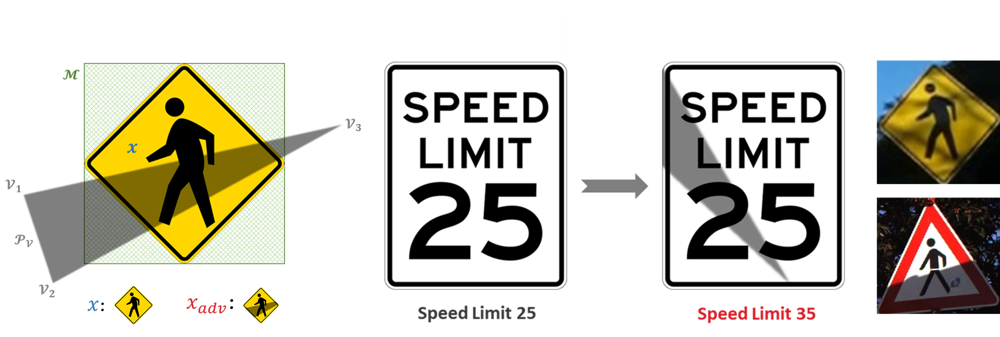

# Adversarial Attack by Shadows

This repository contains the code of our CVPR 2022 paper "[Shadows can be Dangerous: Stealthy and Effective Physical-world Adversarial Attack by Natural Phenomenon](https://arxiv.org/abs/2203.03818)", which study a new type of optical adversarial examples, in which the perturbations are generated by a very common natural phenomenon, shadow, to achieve naturalistic and stealthy physical-world adversarial attack under the black-box setting. 

([Our presentation video](https://www.youtube.com/watch?v=uRb62JE5NS8))


<br>

## Structure

```text
├── adv_img            // The directory for storing adversarial examples generated by shadow_attack.py
│   ├── GTSRB          // Adversarial examples from GTSRB dataset
│   └── LISA           // Adversarial examples from LISA dataset
│       └── 43         // Adversarial examples when k = 0.43
│           └── 81_10_43_True.bmp
│                      // 81: image index in the testing set; 10: ground truth class; 43: number of queries; True: attack succeed
├── dataset            
│   ├── GTSRB  
│   │   ├── train.pkl  // GTSRB training set  
│   │   └── test.pkl   // GTSRB testing set
│   └── LISA
|       ├── train.pkl  // LISA training set
│       └── test.pkl   // LISA testing set
├── mask               // Mask files for different types of traffic signs
│   ├── circle.pkl
│   ├── inverse_triangle.pkl
│   ├── octagon.pkl
│   ├── pentagon.pkl
│   ├── rectangle.pkl
│   ├── rhombus.pkl
│   └── triangle.pkl
├── model        
│   ├── adv_model_gtsrb.pth    // Adversarially trained model for GTSRB dataset
│   ├── adv_model_lisa.pth     // Adversarially trained model for LISA dataset
│   ├── model_gtsrb.pth        // Common model for GTSRB dataset
│   └── model_lisa.pth         // Common model for LISA dataset
├── tmp
├── gtsrb.py           // Code to train and test a model on the GTSRB dataset
├── lisa.py            // Code to train and test a model on the LISA dataset
├── params.json        // Some parameters
├── pso.py             // Code to implement particle swarm optimization
├── README.md
├── schedule_attack.py // The simulation of scheduled attack
├── shadow_attack.py   // Digital & physical attack by shadows
└── utils.py           // Some utility functions
```

## Usage of shadow_attack.py

 - **Datasets and trained models**  
   You should first download [the LISA and GTSRB datasets](https://drive.google.com/file/d/1Du8egeUG6XgAVf-h9IcxRz5gZvs7_Ldq/view?usp=sharing) and [our trained models](https://drive.google.com/file/d/1C0k77EeZrByBUdv36IxS9PiLUvZXRr24/view?usp=sharing) and place them in dataset/ and model/, respectively.  

 - **Requirements:**  
   ```text
   python = 3.8.11
   pytorch = 1.9.0
   torchvision = 0.10.0
   ```
   To run in an environment without cuda enabled, change `"device": "cuda:0"` to `"device": "cpu"` in params.json.


 - **Example 1: show help message.**
   ```shell
   $ python3 shadow_attack.py --help
   ```
   ```text
   usage: shadow_attack.py [-h] [--shadow_level SHADOW_LEVEL] [--attack_db ATTACK_DB] [--attack_type ATTACK_TYPE] [--image_path IMAGE_PATH] [--mask_path MASK_PATH] [--image_label IMAGE_LABEL] [--polygon POLYGON] [--n_try N_TRY] [--target_model TARGET_MODEL]

   optional arguments:
   -h, --help           show this help message and exit
   --shadow_level       shadow coefficient k
   --attack_db          the target dataset should be specified for a digital attack
   --attack_type        digital attack or physical attack
   --image_path         the file path to the target image should be specified for a physical attack
   --mask_path          the file path to the mask should be specified for a physical attack
   --image_label        the ground truth should be specified for a physical attack
   --polygon            The number of sides of polygon P.
   --n_try              n-random-start strategy: retry n times
   --target_model       attack normal model or robust model
   ```
   
 - **Example 2: our digital attack:**  
  The following shell will launch our digital attack on LISA while setting the shadow level $k$ as 0.43. The generated digital adversarial examples will be saved to adv_img/LISA/43/.
   ```shell
   $ python3 shadow_attack.py --shadow_level 0.43 --attack_db LISA
   ```
   ```text
   try 1: Best solution: 0.09873462468385696 succeed
   try 1: Best solution: 0.08393772691488266 succeed
   try 1: Best solution: 0.053570982068777084 succeed
   try 1: Best solution: 0.0678005963563919 succeed
   ...
   try 1: Best solution: 0.09404987096786499 succeed
   try 1: Best solution: 0.06214200705289841 succeed
   try 1: Best solution: 0.11059863865375519 succeed
   Attack finished! Success rate: 0.9822888283378747
   ```
 
 - **Example 3: our physical attack:**  
   The following shell will launch our physical attack. The generated images will be saved as ./tmp/adv_img.png.
   ```shell
   $ python3 shadow_attack.py --shadow_level 0.43 --attack_db GTSRB --attack_type physical --image_path ./tmp/gtsrb_30.png --mask_path ./tmp/gtsrb_30_mask.png --image_label 1 
   ```
   ```text
   iteration: 1 0.7416303753852844
   iteration: 2 0.7226707339286804
   iteration: 3 0.7226707339286804
   iteration: 4 0.7226707339286804
   iteration: 5 0.6017401814460754
   ...
   iteration: 198 0.07176369428634644
   iteration: 199 0.07176369428634644
   iteration: 200 0.07176369428634644
   Best solution: 0.9282363057136536 succeed
   Correct: False Predict: 40 Confidence: 90.27248024940491%
   Attack succeed! Try to implement it in the real world.
   ```
 
 - **Example 4: Change the number of sides of polygon P, e.g., 4:**
   ```shell
   $ python3 shadow_attack.py --attack_db LISA --polygon 4
   ```
